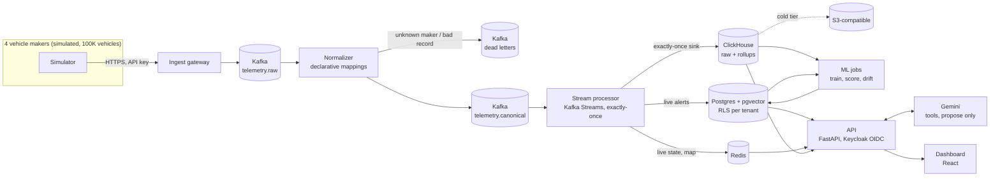

# FleetPulse

**Predictive maintenance for mixed-maker fleets.** Which vehicles will break down in the next 7
days, how sure are we, what is it worth, and who should be inspected where and when, for a fleet
whose vehicles come from several makers with different data formats.

Built on simulated data from 100,000 vehicles and four makers, generated by our own simulator.
Every number below comes from a test or measurement in this repository, on that simulated data.

## What it does

| For | Feature |
|---|---|
| Fleet managers | Fleet health at a glance: vehicles to inspect tomorrow, worth inspecting or fine; tomorrow's bays; today's actions |
| | Live map and alerts (overheating, low 12 V battery, critical fault codes, harsh driving, idling), stored within 0.63 s of the reading for 99% of alerts in our laptop run |
| | 7-day breakdown risk per vehicle with the likely part, the money at stake and the reasons |
| | A service plan within each depot's daily bays, with urgent vehicles first, overflow to nearby depots, and vehicles too risky to wait flagged |
| | A parts forecast per depot, with ranges |
| | A copilot (Gemini) that answers questions and proposes bookings or whole plans; nothing is booked until a manager approves, and each proposal shows its audit trail |
| Workshops | Record what was found; the model is graded against what its probabilities promised |
| Platform team | Onboard a new maker's data format live, without downtime, including data parked before the mapping existed |
| | Feed-drift alarm per maker (e.g. a firmware update sending mph as km/h) and sensor-fault detection |

## Architecture



Why four stores, each for one access pattern: [ADR 0005](docs/adr/0005-polyglot-persistence.md).
All decisions: [docs/adr](docs/adr). Diagrams as images: [system context](docs/diagrams/c4-context.png),
[containers](docs/diagrams/c4-container.png), [deployment](docs/diagrams/deployment.png),
[ER core](docs/diagrams/er-core.png) and [ER operations](docs/diagrams/er-ops.png).

## Run it

Tested with Docker Desktop given 8 GB of memory and 12 CPUs; the memory limits add up to about
12 GB, but the containers use less (see `docker stats`).

```bash
cp .env.example .env              # optional: add GEMINI_API_KEY for the copilot; without it a rule-based assistant answers
docker compose up -d --build --wait   # everything; the simulator seeds 100K vehicles on first start
```

Live telemetry defaults to every vehicle reporting every 30 s (about 3,300 events/s), which a
laptop sustains with room to spare. `SIM_INTERVAL_SECONDS=10` gives the design rate of 10K events/s,
which needs more CPU than our laptop gives Docker.

| Open | Sign in as |
|---|---|
| Dashboard http://localhost:3000 | `acme.manager` / `acme-demo-2026` (manager), `acme.viewer` / `acme-view-2026` (read only), `zenith.manager` / `zenith-demo-2026` (a second company), `ops.admin` / `ops-demo-2026` (platform: vehicle makers) |
| API docs http://localhost:8000/docs | |
| Data viewers: `docker compose --profile tools up -d` | Kafka UI http://localhost:8085, Adminer http://localhost:8086 (server `postgres`, user `fleet_admin`), RedisInsight http://localhost:5540, ClickHouse http://localhost:8123/play (user `fleet`) |

On a smaller machine: `SIM_VEHICLES=20000 docker compose up -d`.

### Environment variables

Every variable has a development default in `docker-compose.yml`, so the stack starts without a
`.env` file. To override one, copy `.env.example` to `.env` and edit it (`.env` is git-ignored).

| Variable | Default | What it sets |
|---|---|---|
| `GEMINI_API_KEY` | empty | Gemini key for the copilot; empty uses the rule-based assistant |
| `SIM_VEHICLES` | `100000` | Number of simulated vehicles |
| `SIM_INTERVAL_SECONDS` | `30` | How often each vehicle reports (`10` is the 10K events/s design rate) |
| `SIM_BACKFILL_DAYS` | `21` | Days of history the backfill writes |
| `DEMO_CONTROLS` | `true` | Enables the Chaos page's fault injection, bursts and pause |
| `NORMALIZER_THREADS`, `PROCESSOR_THREADS` | `6`, `4` | Kafka Streams threads per pipeline service |
| `POSTGRES_PASSWORD`, `APP_DB_PASSWORD`, `SERVICE_DB_PASSWORD` | `*_dev` values | Postgres admin, API (row-level security) and pipeline roles |
| `CLICKHOUSE_PASSWORD`, `CLICKHOUSE_API_PASSWORD` | `*_dev` values | ClickHouse pipeline and read-only API users |
| `KEYCLOAK_ADMIN_PASSWORD` | `keycloak_admin_dev` | Keycloak admin console |
| `S3_ACCESS_KEY`, `S3_SECRET_KEY` | `fleets3`, dev secret | SeaweedFS (S3 API) for ClickHouse cold storage |
| `API_*` | see `services/api/fleetpulse_api/config.py` | API settings, e.g. `API_RATE_LIMIT_PER_SECOND` (20), `API_RATE_LIMIT_BURST` (60) |

The defaults are for local development only; in Kubernetes the values come from a secret
(see [deploy/README.md](deploy/README.md)).

### History and the model (first run only)

Live data starts immediately. The risk model needs history: 21 days for all vehicles, written
straight into ClickHouse (about an hour for 100K vehicles on a laptop; fewer vehicles is faster).

```bash
docker compose --profile setup run --rm backfill                 # 21 days of telemetry and breakdowns
docker compose --profile jobs run --rm ml fleetpulse-train       # train, evaluate, register the model
docker compose --profile jobs run --rm ml fleetpulse-score       # score every vehicle
```

## Evidence

| Claim | How it was checked | Where |
|---|---|---|
| No lost or duplicated telemetry after a crash | Kafka broker hard-killed for 30 s with 100K vehicles reporting (2026-09-30): serving again 70 s after the kill; 2,874,026 events sent = unique events stored = events counted in the per-minute rollup (which would count a re-inserted batch twice). The stream processor was also hard-killed mid-stream (ADR 0001). These are the runs made, on one broker | `tests/chaos/broker-kill.sh`, `tests/chaos/results/broker-kill-20260930T104323Z.txt`, [ADR 0001](docs/adr/0001-exactly-once-telemetry-into-clickhouse.md) |
| Throughput | One laptop (Docker Desktop, 8 GB, 12 CPUs), 2026-09-30. Steady state, 100K vehicles every 30 s: sent ≈ stored ≈ 3,300 events/s for 5 minutes, backlog flat at about 10K events (the sink's 5 s batching). At the 10K events/s design rate for 2 minutes: 9,560/s generated, 8,710/s stored; the backlog peaked near 220K events and drained after the burst. Kafka alone: 40,900 records/s. Alerts: p50 0.44 s, p99 0.63 s from reading to stored alert (58 alerts) | `tests/load/throughput.sh`, `tests/load/results/throughput-20260930T104647Z.txt`, `alert_latency` metric |
| Companies never see each other's data | Isolation enforced in Postgres (row-level security), ClickHouse (row policy) and Redis (keys); tests check "not found" across tenants for vehicles, alerts, bookings and proposals | [ADR 0002](docs/adr/0002-tenant-isolation-in-every-store.md), `services/api/tests` |
| The model beats a mechanic's rule | On held-out vehicles and later days: 80% of breakdowns caught vs 54% at the same number of checks; +$712K a week per 100K vehicles at a $150 inspection (assumed cost) | [ADR 0003](docs/adr/0003-failure-prediction-model.md) |
| It works for a maker it never saw | Leaving each maker out of training: PR-AUC drops by at most 0.011 | ADR 0003 |
| The copilot cannot act alone | It can only create proposals; approval needs the manager role; instructions planted in data were flagged and not followed in our tests | `services/api/tests/test_copilot.py` |

## Run the tests

```bash
mvn -B verify                                   # Java: JUnit and Kafka Streams topology tests, JaCoCo coverage
(cd services/api && uv run pytest -q)           # API: unit tests; integration tests run when the stack is up
(cd services/ml && uv run pytest -q)            # ML: features, leakage, labels, evaluation, drift
(cd web && npm ci && npm test)                  # Web: Vitest

# Need the running stack with live traffic; each writes a report under tests/*/results/
tests/chaos/broker-kill.sh 30                   # hard-kill Kafka for 30 s, then check sent = stored = rollup
tests/load/throughput.sh 3 120                  # Kafka benchmark, then a 3x burst for 120 s end to end
uv run --project services/api python tests/load/api_latency.py 120 10   # API p50/p95/p99 under load
```

CI ([.github/workflows/ci.yml](.github/workflows/ci.yml)) runs on every push: the Java, API, ML and
web suites with lint and type checks, secret and dependency scans (gitleaks, Trivy), a build and
scan of every image, and a whole-stack start that checks telemetry reaches storage. The API
integration tests need Keycloak and the databases, so CI runs the API unit tests only; the
integration suite was run locally against the compose stack. The chaos and load scripts are run
by hand.

## Deploy to a cloud

The same images and Helm chart run on any Kubernetes; only values change (managed Kafka,
Postgres, ClickHouse, Redis endpoints). Terraform for AWS provisions EKS, RDS, MSK,
ElastiCache, S3 and ECR. See [deploy/README.md](deploy/README.md).

## Repository

| Path | What |
|---|---|
| `services/simulator` | 100K vehicles, four makers' formats, realistic faults and failures, history backfill, demo controls |
| `services/ingest-gateway`, `services/normalizer` | Ingest and per-maker mapping to one canonical event, with parking and replay |
| `services/stream-processor` | Live alert rules, live state, exactly-once ClickHouse sink |
| `services/api` | FastAPI: tenant-scoped data, risk, service plan, copilot, onboarding |
| `services/ml` | Failure model (LightGBM, calibrated), scoring, evaluation, feed drift |
| `web` | React dashboard |
| `infra` | Schemas, security, Keycloak realm, ClickHouse tiering |
| `deploy` | Helm chart, Terraform |
| `docs` | Decision records, threat model, [solution document](docs/solution-document.md) |

## Limits

- All data is simulated. The results show the method works on data with realistic structure
  (warning signs before failures, noise, silent faults, harmless fault codes), not what a
  specific real fleet would save.
- The local stack runs one Kafka broker; production uses three (the chart and Terraform assume it).
- Workshop results in the demo come from the simulator's ground truth.
