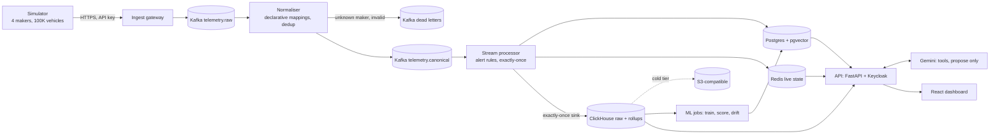

# FleetPulse: predictive maintenance for mixed-maker fleets

Solution document for the Motorq connected-vehicle challenge.

## 1. Summary

A fleet that buys vehicles from several makers receives several data formats, and still loses
vehicles to breakdowns whose warning signs were in that data. FleetPulse answers the question
**"which vehicles are likely to break down in the next 7 days, and what should we do about it?"**
for such a fleet, and turns the answer into a workshop plan that a manager approves.

It combines two of the challenge's problem spaces, because the first depends on the second:

| Problem space | Question answered | Who it helps |
|---|---|---|
| Predictive maintenance (main) | Which vehicles will break down in the next 7 days, how sure are we, what is it worth, and who should be inspected where and when? | Fleet managers, workshops |
| Multi-OEM data normalisation (enabler) | How do we onboard a new maker's data format without downtime, and notice when a feed goes wrong? | Platform team |

Everything runs on simulated data from **100,000 vehicles of four makers**, produced by our own
simulator. Every number in this document comes from a test or measurement in the repository,
on that simulated data, and says which.

## 2. Users and the workflow

| User | What they do in FleetPulse |
|---|---|
| Fleet manager | Opens **Fleet health**: how many vehicles to inspect tomorrow, how many are worth inspecting, tomorrow's bay use, today's actions. Drills into **Breakdown risk** (ranked vehicles, part, reasons, money at stake), a **vehicle** (live state, history, risk and why), the **Service plan** (who, where, when, within depot bays), and books it, or asks the **copilot**, which proposes and waits for approval. |
| Workshop | Records what the inspection found; the model is graded against the probabilities it gave. |
| Platform team | Onboards a new maker's format live (propose mapping, preview on parked data, approve, replay), and watches per-maker feed drift. |

The path a manager follows: *Fleet health → high-risk vehicles → vehicle #4812 → why is it risky →
recommended inspection → book (or approve the copilot's proposal)*.

## 3. The minimum bar, and where it is met

| Requirement | How FleetPulse meets it | Evidence |
|---|---|---|
| Simulated data from ≥ 100,000 vehicles, own simulator | `services/simulator`: 100K vehicles, four makers' payload formats, realistic faults (warning signs before failures, noise, silent faults, harmless fault codes), duplicates, out-of-order and invalid events on purpose, 21-day history backfill | 21 days of history for 98,000 vehicles and 3,669 breakdowns used for training (ADR 0003) |
| Real-time processing and batch analytics | Real time: Kafka → normaliser → Kafka Streams alert rules → Redis live state and Postgres alerts. Batch: ClickHouse history and rollups → model training, daily scoring, feed-drift checks | Section 8 |
| Relational, NoSQL and vector storage, each justified | Postgres (3NF, transactions, row-level security), ClickHouse (columnar telemetry), Redis (live state), pgvector (similar past failures) | ADR 0005 |
| Secure APIs and a usable web interface | FastAPI with Keycloak OIDC; tenant isolation enforced inside every store; React dashboard | ADR 0002, threat model |
| Containerised, tested, deployable on one cloud with no code changes for another | Seven images; `docker compose up` runs everything; one Helm chart with AWS and GCP values files; Terraform for AWS; CI runs tests, scans and a whole-stack smoke test | Section 10 |

## 4. Architecture

- **One canonical event.** Each maker's payload is mapped to one event shape by a declarative
  mapping (field paths plus unit conversions such as mph→km/h, °F→°C, fraction→%). Everything
  downstream (alerts, storage, the model) sees only that shape.
- **Kafka is the durable log.** Every store downstream can be rebuilt by replaying it. That makes the
  exactly-once ClickHouse sink (ADR 0001) and a rebuildable Redis possible.
- **Two paths from the same stream.** Alerts and live state in about a second; history and
  rollups in ClickHouse for the model and dashboards.

Decision records: `docs/adr/0001` (exactly-once into ClickHouse), `0002` (tenant isolation),
`0003` (failure model), `0004` (trusting the data and the model after launch), `0005` (storage).

## 5. Storage, and why each store

| Data | Store | Why |
|---|---|---|
| Tenants, vehicles, alerts, bookings, copilot proposals, audit log, risk scores | Postgres 16, 3NF | Transactions and constraints: a booking and its audit row commit together; row-level security enforces the tenant inside the database |
| Raw telemetry and rollups (per minute, per day) | ClickHouse | Scans history by vehicle and time in seconds; materialised views keep rollups current on insert; cold partitions tier to object storage |
| Live state, live map, alert fan-out | Redis | Sub-millisecond updates of one hash per vehicle; rebuildable from Kafka, so no persistence needed |
| Fault signatures for "similar past failures" | pgvector in Postgres | Thousands of vectors joined to vehicles and repairs; a separate vector database is not worth running at this size |

Deliberate denormalisations (`tenant_id` copied for row-level security) are marked in the schema and
protected by composite foreign keys so the copy cannot drift.

## 6. Multi-maker data and live onboarding

- Four simulated makers with different field names, units and timestamp formats.
- A maker with no mapping is not dropped: its events are **parked** in the dead-letter topic.
- Onboarding a new maker (Draco, 2,000 trucks, in the demo): a platform admin proposes a mapping,
  **previews it on the parked events** with the production mapping engine ("200 of 200 map
  cleanly"), and approves it. Every gateway and normaliser instance picks it up from a compacted
  Kafka topic within about a second, without a restart. The parked events are then replayed.
- Mappings are versioned and audited; Postgres is the record, and the active set is re-published
  to Kafka at start-up, so a rebuilt broker gets back every maker onboarded since.
- **Feed drift per maker** (ADR 0004) compares each maker's last 5 minutes with the 40 before
  (population stability index; speed and rpm while moving), relative to the other makers. In a live
  run it stayed quiet with no bug, flagged the Aurora firmware bug within 5 minutes, and by 7
  minutes read it as "looks like mph sent as km/h".

## 7. The failure model

**Task.** For each vehicle and day: will it break down in the next 7 days? Features come only from
the 7 days up to that day (levels, 3-day trends, days with each fault code). Tests guard against
leakage and label-boundary errors.

**Model.** LightGBM, calibrated with isotonic regression on held-out vehicles so that "81%" means
about 81%. Per-feature contributions are shown as each vehicle's reasons.

**Decision rule.** Flag a vehicle when probability × average saving exceeds the inspection cost
($150 by default, set by the fleet on the page): p > 16.6%. A cost the fleet can change, not a
tuned threshold.

**Results** (ADR 0003; test set: 20% of vehicles never seen in training, later days only):

| | Mechanic's rule | Model, same number of checks | Model, cost rule |
|---|---|---|---|
| Flagged vehicles that broke down | 8.0% | 11.9% | 77.8% |
| Breakdowns caught | 53.9% | 80.1% | 78.0% |
| Net saving per week per 100K vehicles | −$466K | −$303K | **+$712K** |

- PR-AUC 0.748 against a 0.012 base rate; the likely failing part was right 83% of the time;
  predictions of 80–100% came true 93.6% of the time on the test set.
- **A maker the model never saw:** leaving each maker out of training in turn, PR-AUC dropped by at
  most 0.011. This works because features are defined on the canonical event.
- Median warning is 2.7 days ahead: "7 days" is the horizon, not the typical lead time.

## 8. From prediction to action

- **Fleet health** summarises the plan's own rules for the whole fleet and lists today's actions.
- **Service plan:** every vehicle whose expected saving pays for an inspection gets a bay, urgent
  (≥ 80%) vehicles first and only tomorrow, then by value, home depot first, then a depot within
  350 km. Urgent vehicles with no bay are reported as "too risky to wait", not pushed back.
  Booking re-checks everything in one transaction under a per-tenant lock: all or nothing.
- **Parts forecast** per depot: calibrated probabilities add up to expected failures, with a 90% range.
- **Copilot (Gemini, with a rule-based fallback).** It reads through the same tenant-scoped tools as
  the user. It can only create **proposals**; approval is a separate endpoint that requires the
  manager role. Each proposal and decision is written to a **hash-chained, append-only audit log**,
  shown under the proposal as its audit trail. Instructions planted in data were flagged and not
  followed in our tests; the structural control (propose-only) is what is relied on.

## 9. Trusting the data and the model after launch

| Risk | Control | Observed (simulated data, 2026-09-30) |
|---|---|---|
| A broken sensor raises false alarms | Physical rate limits on coolant readings raise SENSOR_FAULT and hold overheat alerts | 3 broken sensors flagged within 20 s each, no overheat alert raised |
| A maker's feed changes silently | Feed drift per maker: last 5 minutes against the 40 before, speed and rpm while moving, relative to the other makers | With no bug, three checks all stable; Aurora firmware bug flagged WATCH after 2 min 17 s and DRIFT after 4 min 40 s, nothing else flagged (live run, 2026-09-30) |
| The model drifts from reality | Workshop results grade the model: faults found vs the sum of promised probabilities | 66 inspections: 86% found against 96% promised; the loop caught the 99% cap as overconfident |

## 10. Security, reliability and operations

**Security** (full table: `docs/threat-model.md`, STRIDE per trust boundary):
Keycloak OIDC (PKCE in the browser, signature, issuer, audience and expiry checked on every
request); roles for viewer, manager and platform admin; tenant enforced inside Postgres (RLS),
ClickHouse (row policy) and Redis (keys), with tests expecting "not found" across tenants;
parameterised SQL; rate limits; API keys for makers; non-root containers; secret and
dependency scans in CI.

**Reliability** (measured on one laptop: Docker Desktop with 8 GB and 12 CPUs):

| Scenario | Result |
|---|---|
| Kafka broker hard-killed, then restarted, and the broker recreated, while telemetry flowed | 6,348,000 events sent; 6,348,000 stored; 6,348,000 counted in the per-minute rollup, which would count a re-inserted batch twice (reconciled by hand, 2026-09-30) |
| Scripted broker kill (`tests/chaos/broker-kill.sh`), 100K vehicles reporting | Broker serving again 70 s after the kill; 2,874,026 sent = stored = counted in the rollup; settled 37 s after new traffic was paused |
| Stream processor hard-killed mid-stream | Sent = stored, no duplicates (ADR 0001) |
| Steady state, 100K vehicles every 30 s | Sent ≈ stored ≈ 3,300 events/s for 5 minutes; backlog flat at about 10K events (the sink's 5 s batches) |
| Design rate, 10K events/s for 2 minutes (`tests/load/throughput.sh`) | 9,560/s generated, 8,710/s stored; backlog peaked near 220K events and drained after the burst. Draining a large backlog, it stored up to about 11,000 events/s |
| Kafka alone (producer benchmark, acks=all) | 40,900 records/s of 400 B |
| Alert latency (reading to stored alert) | p50 0.44 s, p99 0.63 s (58 alerts, steady state) |
| Whole stack after an unclean shutdown | `docker compose up -d --wait` brought all services back healthy in 129 s |
| Memory | About 5 GB across all containers at 100K vehicles |

Found and fixed while testing on this machine: Kafka writing outside its volume, a JVM-based
healthcheck timing out under load, a single-threaded ClickHouse sink, a normaliser killed for
memory, rebalance storms from rebuilding uncompacted state changelogs, a drift job that stopped on
an empty window, and drift false alarms from a baseline spanning restarts. On this laptop the default live rate is
100K vehicles every 30 s (about 3,300 events/s); every 10 s (10K/s) needs more cores than the
laptop gives Docker, which in Kubernetes means more partitions' consumers per service.

**Deployment.** The same images run everywhere, configured only by environment variables. The Helm
chart turns cloud endpoints (managed Kafka, Postgres, ClickHouse, Redis, object storage) into those
variables: `values-aws.yaml` and `values-gcp.yaml` differ, the code does not. Terraform for AWS
provisions EKS, RDS, MSK, ElastiCache, S3 and ECR. `helm lint`, `helm template` and `terraform
validate` pass; neither has been applied to a real cloud account.

**Tests and CI.** Java unit and Kafka Streams topology tests (including crashes between each step
of the ClickHouse sink); API unit and integration tests against the stack (tenant isolation,
booking conflicts, copilot approval and audit trail); ML tests (features, leakage, labels,
evaluation, drift); web tests. CI runs them all, gitleaks and Trivy, builds and scans every image,
and starts the whole stack.

## 11. Limits

- All data is simulated. The results show the method works on data with realistic structure,
  not what a specific real fleet would save.
- Local runs use one Kafka broker; production assumes three. Chaos results cover the scenarios
  run, not multi-broker partitions or disk loss.
- Workshop results in the demo come from the simulator's ground truth.
- When a Gemini key is configured, tool results leave for Google; production would need a data
  processing agreement or a self-hosted model.

## 12. Demo

1. **Nothing lost:** kill the Kafka broker while telemetry flows; the Chaos page shows sent = stored
   after recovery, with duplicates, invalid and out-of-order events rejected on purpose.
2. **A new maker, live:** Draco's 2,000 trucks are parked as unknown; propose the mapping, preview
   it on the parked data, approve; the parked data is replayed and Draco appears on the map.
3. **A breakdown avoided:** Fleet health → the first vehicle in line (its risk, likely part, reasons
   and the money at stake) → ask the copilot to book it → the manager approves → the audit trail
   shows the copilot proposing and the manager approving.
